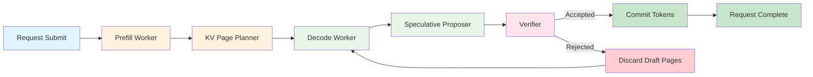

# XL-Persistent-Kernel

**CPU-first control-plane simulator and CUDA staging ground for persistent-kernel LLM decode.**

This repository is not a production inference stack. It is a research scaffold for building the control flow, scheduling, and memory-management infrastructure that a persistent CUDA decode kernel will eventually need.

The simulator runs entirely on CPU today, but it is structured so that every abstractions (backend, KV-cache, request descriptors) can be swapped for real device implementations without rewriting the runtime.

## Architecture



**Request lifecycle:**

1. A request is submitted with prompt tokens and a target output sequence.
2. The **prefill worker** processes the prompt and builds the initial KV-cache pages.
3. The **KV page planner** allocates physical pages across all layers.
4. The **decode worker** pins the active pages and runs the decode loop.
5. The **speculative proposer** drafts a block of candidate tokens.
6. The **verifier** checks the draft against the target and the backend.
7. Accepted tokens are committed; rejected draft pages are released.
8. The request completes when EOS is hit, the token budget is exhausted, or the target is fully matched.

## What Is Implemented Today

- **Runtime simulator** with specialized prefill and decode workers
- **Speculative block proposal and verification** with configurable acceptance policy
- **Paged KV-cache planner** with LRU eviction, pinning, and memory accounting
- **Backend interface** (`AbstractKernelBackend`) + deterministic CPU stub backend
- **Benchmark harness** exporting TTFT, ITL, acceptance rate, KV hit rate, live/pinned KV bytes, fragmentation
- **Speculative KV distinction** between committed and draft pages
- **CUDA staging layer** with a persistent-kernel stub (optional build)
- **CI pipeline** (pytest + ruff + mypy on Python 3.10/3.11/3.12)
- **Tests** covering runtime, KV cache, speculative KV lifecycle, and benchmark schema

## What Is Not Implemented Yet

- Real CUDA attention / projection / sampling kernels
- Fused speculative-verify kernels
- Device-resident request descriptors and work queues
- Multi-GPU / NVLink communication overlap
- Continuous batching with dynamic request admission
- Real transformer math on device
- Quantized weight and KV support
- Memory-mapped model loading

These are planned phases (see [docs/ROADMAP.md](docs/ROADMAP.md)).

## Why Persistent Kernels Matter

Traditional LLM decode launches one kernel per token per request:

```
Host: launch attention kernel -> wait -> launch projection -> wait -> sample -> wait -> repeat
```

Each launch incurs host-device synchronization, kernel launch overhead, and memory fence costs. For small batch sizes, this dominates runtime.

A persistent kernel keeps one long-lived GPU loop running:

```
Device: loop {
  read request descriptor from global memory
  load KV pages
  run attention + projection + sample
  write new token and update decode position
  if done, write completion status
}
```

The kernel never returns to the host until all requests complete. The host only manages request admission, KV page allocation, and completion callbacks.

This is the execution model behind production systems like vLLM's persistent batch, Xiaomi's Mirage/TileRT, and SGLang's RadixAttention. This repository builds the control-plane simulator that such a kernel requires.

## Quick Start

```bash
# Install in development mode
pip install -e ".[dev]"

# Run the demo
python -m megakernel_lab.demo

# Run tests
python -m pytest tests/ -v

# Run benchmarks
python -c "from megakernel_lab.bench import BenchmarkRunner; print(BenchmarkRunner().run())"

# Or use Make targets
make help
make demo
make test
make bench
```

## Benchmark Example Output

```
   batch_size  block_size  mean_ttft_ms  mean_itl_ms  acceptance_rate  kv_hit_rate  live_kv_bytes  pinned_kv_bytes  eviction_count  fragmentation_ratio
0           1           1          0.75         0.25              1.0          0.0           320              256               0                  0.0
1           1           2          0.75         0.25              1.0          0.0           320              256               0                  0.0
2           4           1          0.75         0.25              1.0          0.0          1280             1024               0                  0.0
3           4           4          0.75         0.25              1.0          0.0          1280             1024               0                  0.0
4           8           1          0.75         0.25              1.0          0.0          2560             2048               0                  0.0
5           8           4          0.75         0.25              1.0          0.0          2560             2048               0                  0.0
```

## Repository Structure

```
src/megakernel_lab/
    config.py           - Runtime configuration (block size, layers, KV dimensions)
    state.py            - Request, worker, and backend state objects
    runtime.py          - Persistent decode runtime with worker pool
    kv_cache.py         - Paged KV-cache with LRU eviction, pinning, memory accounting
    spec_decode.py      - Speculative block proposer and verifier
    backend.py          - Abstract kernel backend + CPU stub
    bench.py            - Benchmark harness with CSV export
    demo.py             - Runnable demo comparing decode modes

cuda/
    persistent_decode_stub.cu  - Minimal CUDA persistent-kernel stub
    request_desc.h             - Request descriptor struct for device
    CMakeLists.txt             - Optional CUDA build

tests/
    test_runtime.py     - Runtime and worker tests
    test_kv_cache.py    - KV cache allocation, eviction, memory accounting
    test_spec_kv.py     - Speculative KV page lifecycle tests
    test_bench.py       - Benchmark schema validation

docs/
    ARCHITECTURE.md     - Design intent and core concepts
    CUDA_STAGING.md     - Host/device queue design document
    ROADMAP.md          - Development phases
```

## Development

```bash
make install     # Install with dev dependencies
make lint        # Run linters
make format      # Auto-fix formatting
make test        # Run test suite
```

## License

Research use only. See LICENSE for details.
